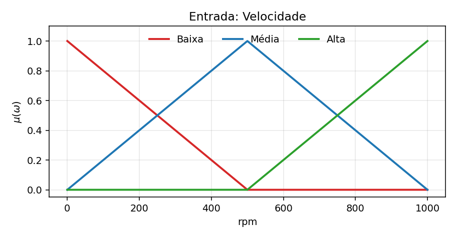
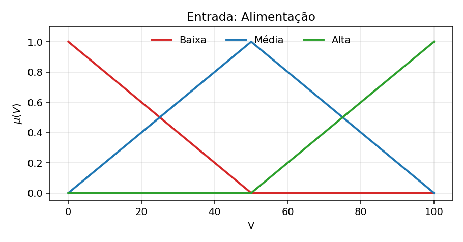
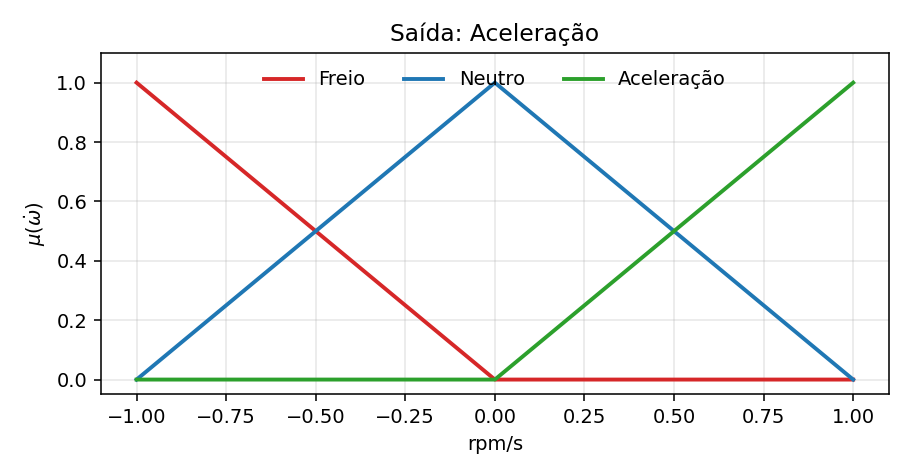
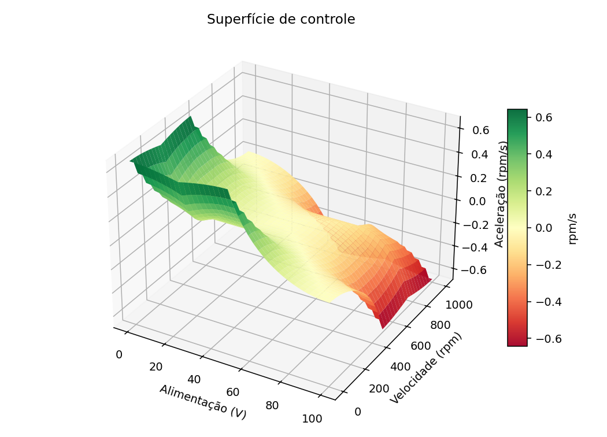
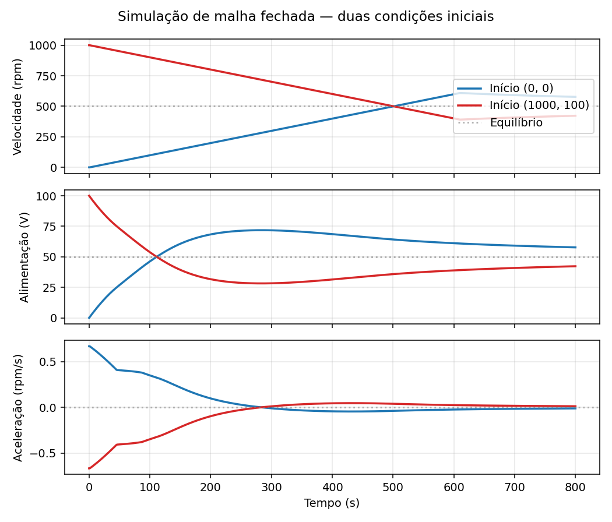

# Relatório — Controle de velocidade de motor DC com lógica fuzzy preditiva

**PCS5708 — Exercício 1 — abordagem Mamdani**

## 1. Especificação do problema

Projetar um sistema de controle de velocidade rotacional para um motor DC usando lógica fuzzy preditiva. Restrições do problema:

- Motor: $\omega \in [0, 1000]$ rpm
- Fonte DC: $V \in [0, 100]$ V
- Taxa máxima de aceleração ou frenagem: $\pm 1$ rpm/s
- Ação de controle: incremento ou decremento da fonte por $\pm 1$ V

A relação física básica: para acelerar o motor, aumenta-se a tensão; para frear, reduz-se a tensão. Esta heurística é codificada na base de regras.

## 2. Variáveis e dimensionamento

| Tipo    | Variável     | Domínio        | Termos linguísticos        |
| ------- | ------------ | -------------- | -------------------------- |
| Entrada | Velocidade   | [0, 1000] rpm  | Baixa, Média, Alta         |
| Entrada | Alimentação  | [0, 100] V     | Baixa, Média, Alta         |
| Saída   | Aceleração   | [-1, +1] rpm/s | Freio, Neutro, Aceleração  |

A *variável de controle* — relação entre aceleração (saída) e alimentação — é interpretada como: a saída fuzzy de aceleração (em rpm/s) é também a taxa de variação da tensão (V/s). Em uma decisão "Acelerar" plena (saída = +1), a fonte aumenta 1 V/s e o motor responde acelerando 1 rpm/s.

## 3. Funções de pertinência

As três variáveis usam triangulares e ombros (shoulders) lineares, conforme as transparências da disciplina.

### 3.1 Velocidade

- **Baixa**: ombro decrescente — $\mu = 1$ em $\omega = 0$, $\mu = 0$ em $\omega = 500$.
- **Média**: triangular com pico em $\omega = 500$, base em $0$ e $1000$.
- **Alta**: ombro crescente — $\mu = 0$ em $\omega = 500$, $\mu = 1$ em $\omega = 1000$.



### 3.2 Alimentação

Análoga, mapeada para o intervalo $[0, 100]$ V.



### 3.3 Aceleração (saída)

- **Freio**: ombro decrescente — $\mu = 1$ em $-1$ rpm/s, $\mu = 0$ em $0$.
- **Neutro**: triangular com pico em $0$, base em $-1$ e $+1$.
- **Aceleração**: ombro crescente — $\mu = 0$ em $0$, $\mu = 1$ em $+1$ rpm/s.



## 4. Base de regras

São nove regras (3 × 3) cobrindo todas as combinações dos termos das duas entradas:

| Velocidade \ Alimentação | Baixa      | Média      | Alta      |
| ------------------------ | ---------- | ---------- | --------- |
| **Baixa**                | Aceleração | Aceleração | Neutro    |
| **Média**                | Aceleração | Neutro     | Freio     |
| **Alta**                 | Neutro     | Freio      | Freio     |

A base codifica uma heurística *preditiva*:

- **Velocidade Baixa & Alimentação Baixa → Acelerar**: motor parado, tensão baixa — aumentar tensão.
- **Velocidade Baixa & Alimentação Alta → Neutro**: motor lento mas tensão alta — o próprio motor irá acelerar pela tensão; não adicionar mais.
- **Velocidade Alta & Alimentação Baixa → Neutro**: motor rápido mas tensão baixa — o motor já irá desacelerar; não tirar mais tensão.
- **Velocidade Alta & Alimentação Alta → Frear**: motor rápido e tensão alta — reduzir.

O caráter *preditivo* está nas células anti-diagonais ($\text{Baixa} \times \text{Alta}$ e $\text{Alta} \times \text{Baixa}$): em vez de reagir somente ao estado atual, o controlador antecipa que a dinâmica natural do motor já está a corrigir o estado.

## 5. Inferência

Mamdani clássico:

- t-norma para AND (entre antecedentes): `min`.
- Implicação de Mamdani: recorte (clipping) da função de pertinência do consequente pela força da regra.
- Agregação inter-regras: `max`.
- Defuzzificação: centróide.

Para cada regra $i$:

$$
w_i = \min_{v \in \mathrm{antec}_i} \mu_{A_v}(x_v),
\qquad
\mu_{B_i'}(y) = \min(w_i,\ \mu_{B_i}(y))
$$

Saída agregada:

$$
\mu_{B'}(y) = \max_i \mu_{B_i'}(y)
$$

Saída crisp por centróide:

$$
y^* = \frac{\sum_y y \cdot \mu_{B'}(y)}{\sum_y \mu_{B'}(y)}
$$

A defuzzificação usa um grid discreto sobre $[-1, +1]$ com 401 pontos.

## 6. Superfície de controle

Avaliando o FIS sobre toda a grade $[0, 1000] \times [0, 100]$:



Observações:

- **Diagonal $\omega \approx 10 V$**: aceleração próxima de zero — equilíbrio implícito.
- **Quadrante "$\omega$ baixo, $V$ baixo"**: aceleração positiva (acelerar).
- **Quadrante "$\omega$ alto, $V$ alto"**: aceleração negativa (frear).
- A superfície é *suave* (sem descontinuidades) graças à sobreposição dos termos linguísticos e ao centróide.

## 7. Avaliações pontuais

Saída do controlador em pontos representativos:

| Velocidade (rpm) | Alimentação (V) | Aceleração (rpm/s) |
| ---------------: | --------------: | -----------------: |
|                0 |               0 |             +0.668 |
|              200 |              20 |             +0.177 |
|              500 |              50 |             +0.000 |
|              700 |              70 |             -0.076 |
|              900 |              90 |             -0.347 |
|             1000 |             100 |             -0.668 |

A simetria em torno do ponto $(500, 50)$ reflete a simetria da base de regras.

## 8. Modelo da planta

Modelo simplificado de motor DC para a simulação:

- Velocidade de equilíbrio em estado estacionário: $\omega_{ss}(V) = 10\,V$.
- Resposta natural: $\dot\omega = \mathrm{clip}(\omega_{ss}(V) - \omega,\, -1,\, +1)$ rpm/s.
- Atuador: $\dot V = \mathrm{acc}_{\mathrm{FIS}}(\omega, V)$ V/s, com saturação em $[0, 100]$ V.

A taxa máxima de aceleração da planta ($1$ rpm/s) é o gargalo principal — para o motor cobrir a metade de seu range ($500$ rpm), são necessários ao menos $500$ s.

## 9. Simulação em malha fechada

Foram simuladas duas condições iniciais durante $800$ s:

1. Motor em repouso: $\omega(0) = 0$, $V(0) = 0$.
2. Motor saturado: $\omega(0) = 1000$, $V(0) = 100$.



Observações:

- Ambas as trajetórias convergem para a vizinhança do ponto de equilíbrio $(\omega \approx 500\ \mathrm{rpm},\ V \approx 50\ \mathrm{V})$ — o estado em que apenas a regra (Média, Média $\to$ Neutro) dispara com força máxima e a saída do controlador é zero.
- Há um leve *overshoot* (~$\pm 100$ rpm) decorrente da dinâmica rate-limited da planta: a velocidade não consegue acompanhar imediatamente as mudanças na tensão, e a tensão precisa "puxar" antes de a planta responder.
- A aceleração de comando é monotonicamente decrescente em magnitude — característica típica de uma superfície de controle suave e estabilizadora.

## 10. Conclusões

- O controlador fuzzy projetado é **estável**: independentemente da condição inicial dentro do espaço de operação, o sistema converge para o ponto de equilíbrio $(500, 50)$.
- A *predição* embutida nas regras anti-diagonais (Baixa × Alta e Alta × Baixa, ambas mapeando para *Neutro*) impede correções excessivas, suavizando a resposta.
- Como o FIS recebe apenas $(\omega, V)$ e não recebe um *setpoint* explícito, este controlador, na forma apresentada, regula o motor a um regime "médio" implícito determinado pela base de regras. Para *seguir* uma referência arbitrária, seria necessário transformar as entradas — por exemplo, usar erro $e = \omega_{\mathrm{ref}} - \omega$ e variação $\dot e$ como entradas — mantendo a mesma estrutura de inferência.
- O método Mamdani entrega uma superfície de controle suave e interpretável: cada quadrante está claramente associado a uma decisão linguística e a sintonia se traduz em ajustar a base de regras ou as funções de pertinência, ambos passos transparentes para um especialista do domínio.

## 11. Como executar

A partir da raiz do repositório:

```bash
python exercises/exercicio1_motor_control/motor_control.py
```

A execução gera as cinco figuras em `figures/` e imprime a tabela de avaliações pontuais no terminal.
