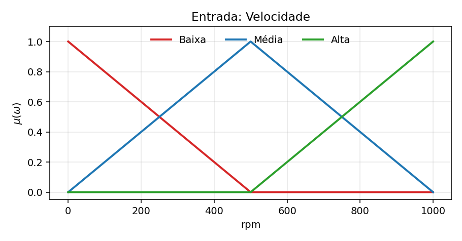
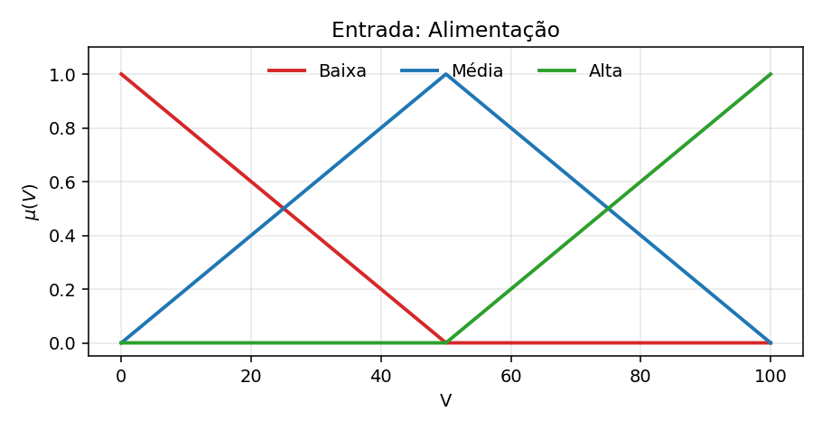
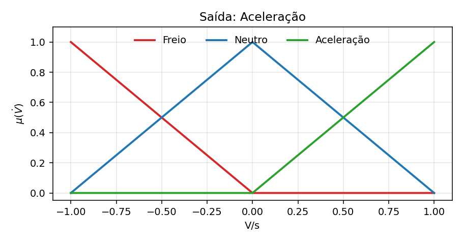
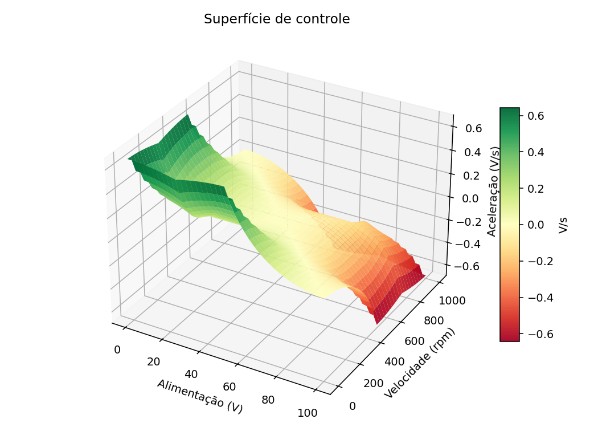
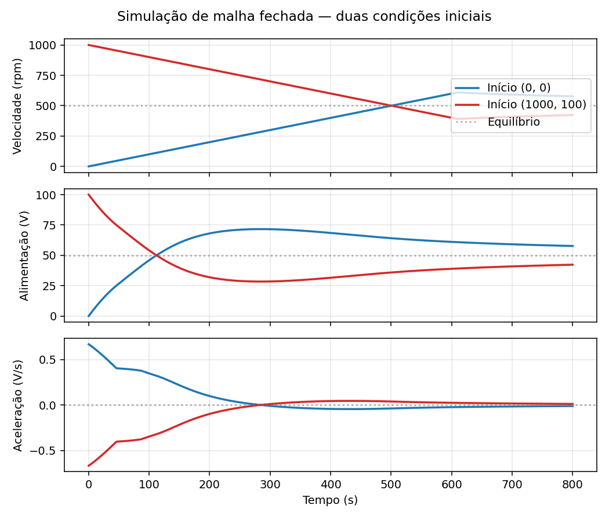

# Report — DC motor speed control with predictive fuzzy logic

**PCS5708 — Exercise 1 — Mamdani approach**

## 1. Problem specification

Design a rotational speed control system for a DC motor using predictive fuzzy logic. Constraints:

- Motor: $\omega \in [0, 1000]$ rpm
- DC source: $V \in [0, 100]$ V
- Maximum acceleration / braking rate: $\pm 1$ rpm/s
- Control action: increment or decrement the supply voltage by $\pm 1$ V

Basic physical relationship: to accelerate the motor, raise the voltage; to brake, lower it. This heuristic is encoded in the rule base.

## 2. Variables and dimensioning

| Type   | Variable     | Domain         | Linguistic terms          |
| ------ | ------------ | -------------- | ------------------------- |
| Input  | Velocidade   | [0, 1000] rpm  | Baixa, Média, Alta        |
| Input  | Alimentação  | [0, 100] V     | Baixa, Média, Alta        |
| Output | Aceleração   | [-1, +1] V/s   | Freio, Neutro, Aceleração |

The *control variable* — the relationship between the FIS output and the supply voltage — is interpreted as follows: the fuzzy output is the rate of change of the supply voltage, $\dot V$, in **V/s**. This is a voltage rate, not a speed rate: the motor's own dynamics — $\omega_{ss}(V) = 10\,V$ and the $\pm 1$ rpm/s rate limiter — turn a change in $V$ into a change in $\omega$. At a full *Acelerar* decision (output $= +1$ V/s), the source voltage rises at 1 V/s, which commands an equilibrium-speed change of $10\,\mathrm{V/s} \times 10\,\mathrm{rpm/V} = 10$ rpm/s — ten times the plant's $\pm 1$ rpm/s rate limit, so the actual acceleration the motor delivers is clipped to 1 rpm/s. The two rates differ by exactly the plant gain of 10. This gap between the voltage-side command and the speed-side response is not negligible: simulating the closed loop from rest shows $\max|V - \omega/10|$ reaching about 48 V near $t = 200$ s — the commanded equilibrium speed runs roughly 480 rpm ahead of the actual speed at that point in the transient.

Linguistic-term glossary: Baixa = Low, Média = Medium, Alta = High; Freio = Brake, Neutro = Neutral, Aceleração = Accelerate.

## 3. Membership functions

The three variables use linear triangulars and shoulders, following the course slides.

### 3.1 Velocidade

- **Baixa**: descending shoulder — $\mu = 1$ at $\omega = 0$, $\mu = 0$ at $\omega = 500$.
- **Média**: triangular, peak at $\omega = 500$, base at $0$ and $1000$.
- **Alta**: rising shoulder — $\mu = 0$ at $\omega = 500$, $\mu = 1$ at $\omega = 1000$.



### 3.2 Alimentação

Analogous, mapped to the interval $[0, 100]$ V.



### 3.3 Aceleração (output)

The output is a voltage rate $\dot V$ in V/s (see §2), not a speed rate.

- **Freio**: descending shoulder — $\mu = 1$ at $-1$ V/s, $\mu = 0$ at $0$.
- **Neutro**: triangular, peak at $0$, base at $-1$ and $+1$.
- **Aceleração**: rising shoulder — $\mu = 0$ at $0$, $\mu = 1$ at $+1$ V/s.



## 4. Rule base

Nine rules (3 × 3) covering all combinations of the two input terms:

| Velocidade \ Alimentação | Baixa      | Média      | Alta      |
| ------------------------ | ---------- | ---------- | --------- |
| **Baixa**                | Aceleração | Aceleração | Neutro    |
| **Média**                | Aceleração | Neutro     | Freio     |
| **Alta**                 | Neutro     | Freio      | Freio     |

The base encodes a *predictive* heuristic:

- **Velocidade Baixa & Alimentação Baixa → Acelerar**: motor stopped, voltage low — raise voltage.
- **Velocidade Baixa & Alimentação Alta → Neutro**: motor slow but voltage high — the motor is about to accelerate from the voltage alone; do not push more.
- **Velocidade Alta & Alimentação Baixa → Neutro**: motor fast but voltage low — the motor will already decelerate; do not lower the voltage further.
- **Velocidade Alta & Alimentação Alta → Frear**: motor too fast and voltage high — reduce.

The *predictive* character lies in the anti-diagonal cells (Baixa × Alta and Alta × Baixa): instead of reacting only to the current state, the controller anticipates that the natural dynamics of the motor are already correcting it.

## 5. Inference

Classical Mamdani:

- t-norm for AND (between antecedents): `min`.
- Mamdani implication: clipping of the consequent membership function by the rule strength.
- Inter-rule aggregation: `max`.
- Defuzzification: centroid.

For each rule $i$:

$$
w_i = \min_{v \in \mathrm{antec}_i} \mu_{A_v}(x_v),
\qquad
\mu_{B_i'}(y) = \min(w_i,\ \mu_{B_i}(y))
$$

Aggregated output:

$$
\mu_{B'}(y) = \max_i \mu_{B_i'}(y)
$$

Crisp output by centroid:

$$
y^* = \frac{\sum_y y \cdot \mu_{B'}(y)}{\sum_y \mu_{B'}(y)}
$$

Defuzzification uses a discrete grid of 401 points over $[-1, +1]$.

## 6. Control surface

Evaluating the FIS over the full grid $[0, 1000] \times [0, 100]$:



Observations:

- **Diagonal $\omega \approx 10 V$**: the output is *not* uniformly close to zero along this diagonal — it is only exactly zero at the single point $(500, 50)$. Evaluated along the diagonal: $+0.668$ at $(0, 0)$, $+0.177$ at $(200, 20)$, $0.000$ at $(500, 50)$, $-0.668$ at $(1000, 100)$. $(500, 50)$ is the controller's only fixed point (see §9–§10); away from it the diagonal still commands a non-trivial voltage rate.
- **"$\omega$ low, $V$ low" quadrant**: positive output (raise the voltage).
- **"$\omega$ high, $V$ high" quadrant**: negative output (lower the voltage).
- The surface is *smooth* (no discontinuities) thanks to the linguistic-term overlap and the centroid defuzzification.

## 7. Pointwise evaluations

Controller output at representative points (in V/s — a voltage rate, not a speed rate; see §2):

| Velocidade (rpm) | Alimentação (V) | Aceleração (V/s) |
| ---------------: | --------------: | ----------------: |
|                0 |               0 |             +0.668 |
|              200 |              20 |             +0.177 |
|              500 |              50 |             +0.000 |
|              700 |              70 |             -0.076 |
|              900 |              90 |             -0.347 |
|             1000 |             100 |             -0.668 |

These values are unchanged from before the block-diagram port: this is a static evaluation of the FIS, independent of the plant's integration scheme.

The symmetry around $(500, 50)$ reflects the symmetry of the rule base.

## 8. Plant model

Simplified DC motor model used for the simulation:

- Steady-state velocity: $\omega_{ss}(V) = 10\,V$.
- Natural response: $\dot\omega = \mathrm{clip}(\omega_{ss}(V) - \omega,\, -1,\, +1)$ rpm/s.
- Actuator: $\dot V = \mathrm{acc}_{\mathrm{FIS}}(\omega, V)$ V/s, saturated at $[0, 100]$ V.

The plant's max acceleration ($1$ rpm/s) is the main bottleneck — to traverse half its range ($500$ rpm), at least $500$ s are required.

## 9. Closed-loop simulation

Two initial conditions were simulated for $800$ s:

1. Motor at rest: $\omega(0) = 0$, $V(0) = 0$.
2. Motor saturated: $\omega(0) = 1000$, $V(0) = 100$.

The plant is simulated as a block diagram (`fuzzy.sim`, RK4 integration) rather
than the hand-rolled explicit-Euler loop used earlier. The plant's unclipped
time constant is $1$ s, so Euler at $dt = 1$ s was exactly dead-beat; RK4
resolves the same interval with intermediate derivative evaluations and gives
slightly different numbers — an accuracy improvement, not a regression. For
reference, the two integrators give, from rest, a state at $t = 800$ s of
$(\omega, V) \approx (577.4,\ 57.7)$ (Euler) versus $(577.2,\ 57.7)$ (RK4).



Observations:

- Neither trajectory has reached the fixed point by $t = 800$ s. The actual
  states at $t = 800$ s are $(\omega, V) \approx (577.2\ \mathrm{rpm},\ 57.7\ \mathrm{V})$
  from rest and $(\omega, V) \approx (422.8\ \mathrm{rpm},\ 42.3\ \mathrm{V})$ from
  saturation — both still about 15% away from $(500, 50)$, not "the
  neighbourhood" of it. The control surface (§6) flattens sharply as $(\omega, V)$
  approaches the diagonal near $(500, 50)$ (output magnitude drops from $0.668$
  at the extremes to $0.177$ at $(200, 20)$ to $0$ only exactly at $(500, 50)$),
  so the commanded rate — and therefore the approach speed — keeps shrinking.
  True convergence to the fixed point takes on the order of $10^5$ s, far beyond
  the plotted horizon.
- Both trajectories are still monotonically approaching $(500, 50)$ over the
  plotted window, and the commanded voltage rate is monotonically decreasing in
  magnitude — evidence of a stabilizing control surface, even though the window
  is too short to show settling.
- A small *overshoot* (~$\pm 100$ rpm) appears early in the transient because of
  the rate-limited plant: the velocity cannot follow voltage changes
  immediately, and the voltage must "lead" before the plant responds.

## 10. Conclusions

- The fuzzy controller designed is **asymptotically stable** toward the single
  fixed point $(500, 50)$: regardless of the initial condition within the
  operating space, the trajectory moves monotonically toward it. Convergence is
  slow near the fixed point, though — see §9 — so an $800$ s run only gets
  partway there.
- The *prediction* built into the anti-diagonal rules (Baixa × Alta and Alta × Baixa, both mapping to *Neutro*) prevents excessive corrections, smoothing the response.
- Since the FIS receives only $(\omega, V)$ and no explicit *setpoint*, this controller, in its current form, regulates the motor at an implicit "middle" regime determined by the rule base. To *track* an arbitrary reference, the inputs would need to be transformed — e.g. use error $e = \omega_{\mathrm{ref}} - \omega$ and error rate $\dot e$ as inputs — preserving the same inference structure.
- The Mamdani method delivers a smooth and interpretable control surface: each quadrant is clearly associated with a linguistic decision, and tuning becomes a matter of adjusting the rule base or the membership functions, both transparent steps for a domain expert.

---

## Errata — corrections after submission

This report was submitted with a units error and two incorrect claims about the
controller's equilibrium. The body has been corrected; this records what changed.

### E.1 The output is a voltage rate, not a speed rate

The FIS output was **applied** as $\dot V$ in V/s — the simulation integrates
`V += output * dt` — but was **labelled** rpm/s throughout: the output variable table,
the membership-function plots, the control-surface axis, the pointwise table, and §2.

The code was right and the labels were wrong. The assignment asks the controller to
"increment or decrement the supply voltage", so a voltage rate is the intended output.
Everything is now labelled V/s. **No simulated behaviour changes** — only the labels.

The submitted §2 also stated that at a full *Acelerar* decision "the source rises 1 V/s and
the motor responds by accelerating at 1 rpm/s". That is wrong. Since $\omega_{ss} = 10V$,
a rise of 1 V/s commands **10 rpm/s** of equilibrium-speed change, which the plant's own
limiter then clips to 1 rpm/s. The two rates differ by exactly the plant gain of 10, and the
gap is not academic: over a run from rest, $\max\lvert V - \omega/10 \rvert$ reaches
**48.1 V** near $t = 200$ s — the commanded equilibrium speed running roughly 480 rpm ahead
of the actual speed.

### E.2 The diagonal is not an equilibrium

Submitted §6 claimed *"Diagonal $\omega \approx 10V$: acceleration close to zero — implicit
equilibrium."* Evaluating the controller along that line gives $+0.668$ at $(0,0)$,
$+0.177$ at $(200,20)$, $0.000$ at $(500,50)$, and $-0.668$ at $(1000,100)$. Only
$(500, 50)$ is a fixed point. Sections §9 and §10 of the submitted report already said this
correctly, so the report contradicted itself; §6 is now corrected.

### E.3 Convergence was overstated

Submitted §9–§10 stated that the system "converges to the neighbourhood of $(500, 50)$" over
the plotted 800 s. The states at $t = 800$ s are actually $(577.2, 57.7)$ from rest and
$(422.8, 42.3)$ from saturation — both about 15 % away. The controller *is* asymptotically
stable, but the control surface flattens near the fixed point, so true convergence takes on
the order of $10^5$ s. The claim now matches what the figure shows.

### E.4 Method change

The simulation moved from explicit Euler at $\Delta t = 1.0$ s to RK4 on an assembled block
diagram. Euler at $\Delta t = 1$ s against the plant's own 1 s time constant was exactly
dead-beat, so the change is an improvement; it moves the trajectory values in the third
significant figure ($\omega = 577.4 \to 577.2$ at $t = 800$ s). The pointwise evaluation
table in §7 is a static FIS evaluation and is **unchanged**.

## 11. How to run

Install the package once from the repository root, then run the script:

```bash
pip install -e .
python exercises/exercicio1_motor_control/motor_control.py
```

The run generates the five figures in `figures/` plus `diagram.json` (the block-diagram spec, for the graphical editor), and prints the pointwise evaluation table and closed-loop summary statistics to the terminal.
