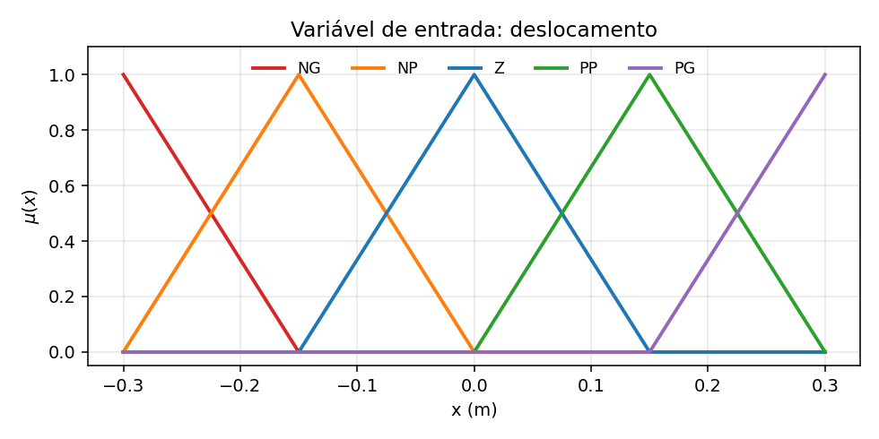
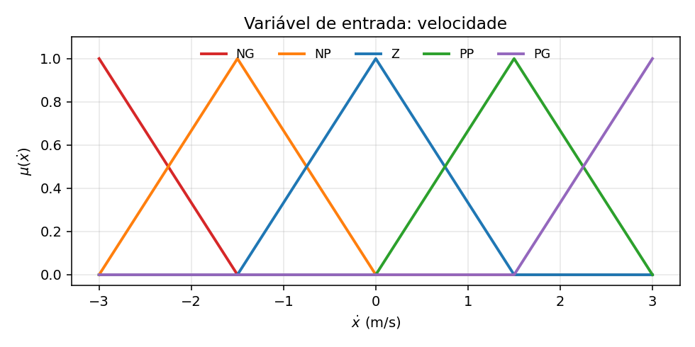
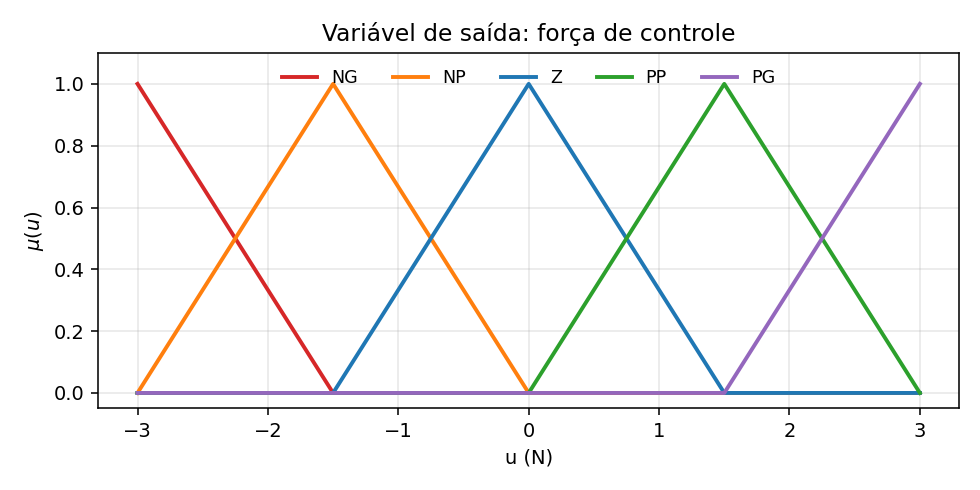
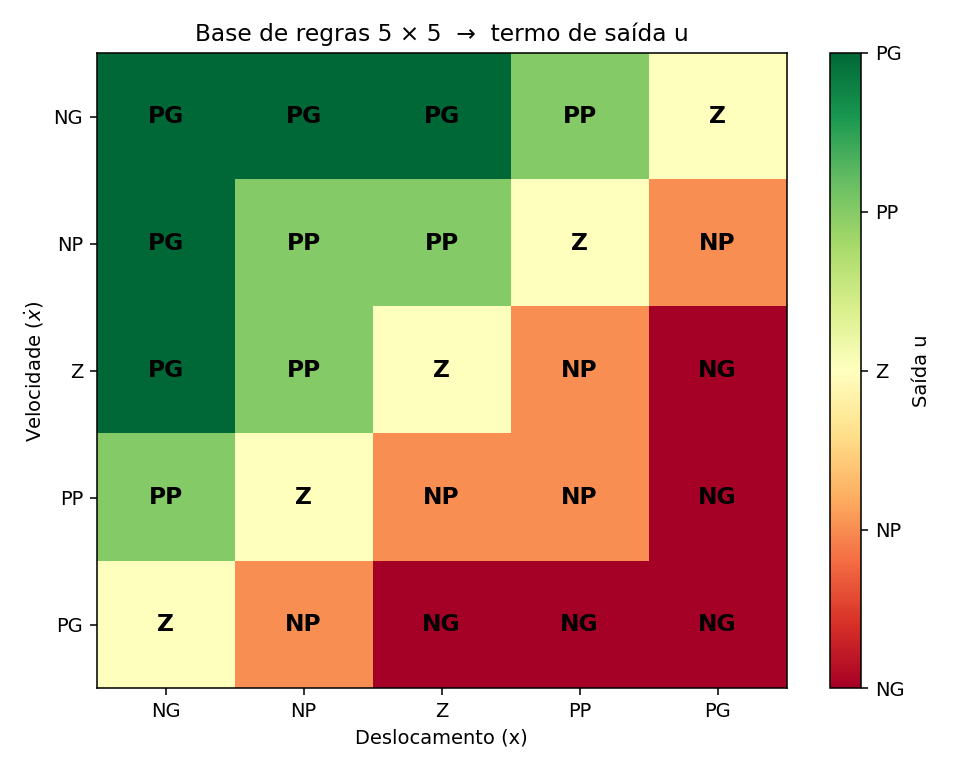
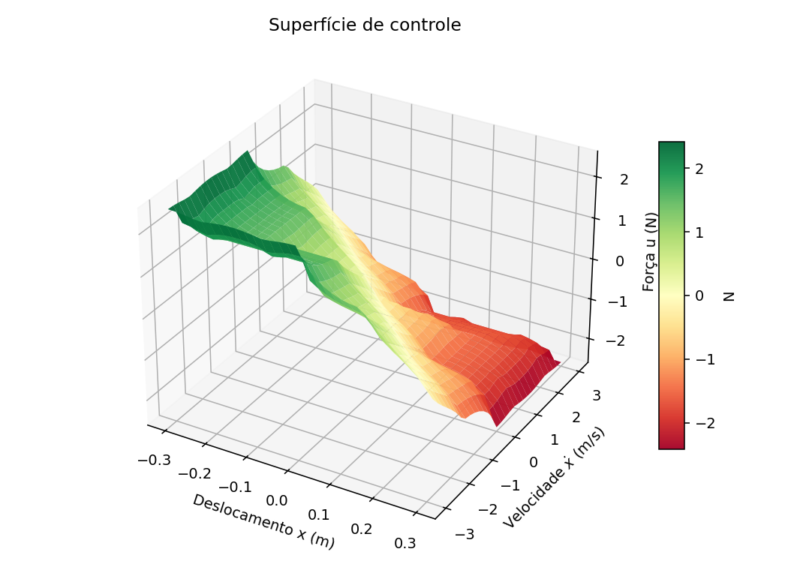
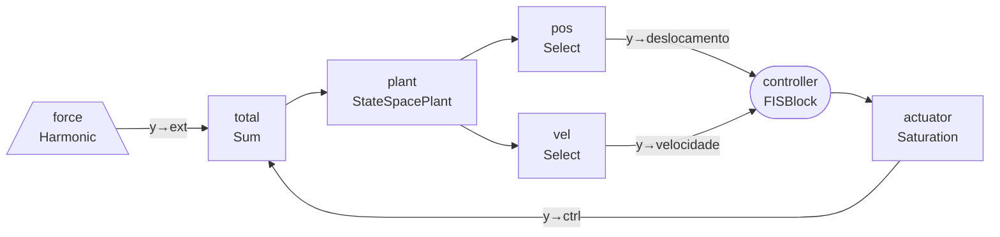
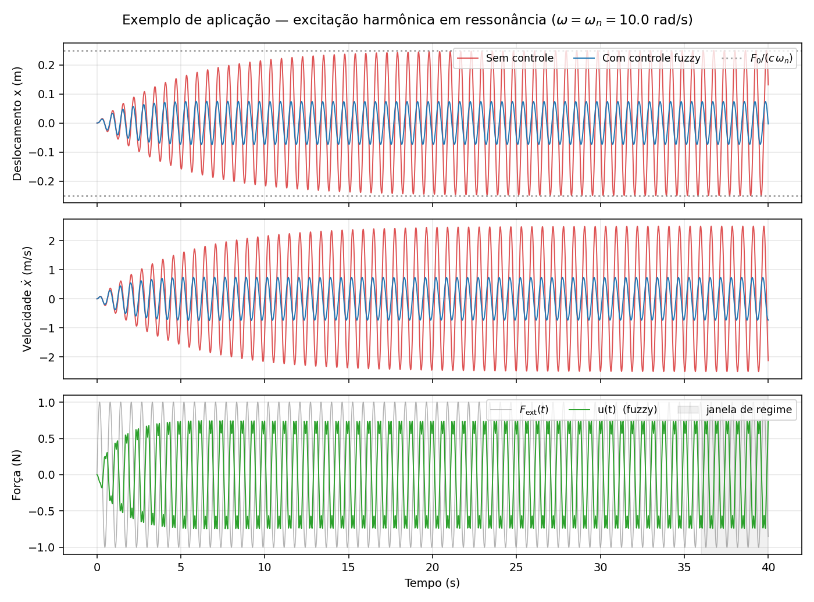
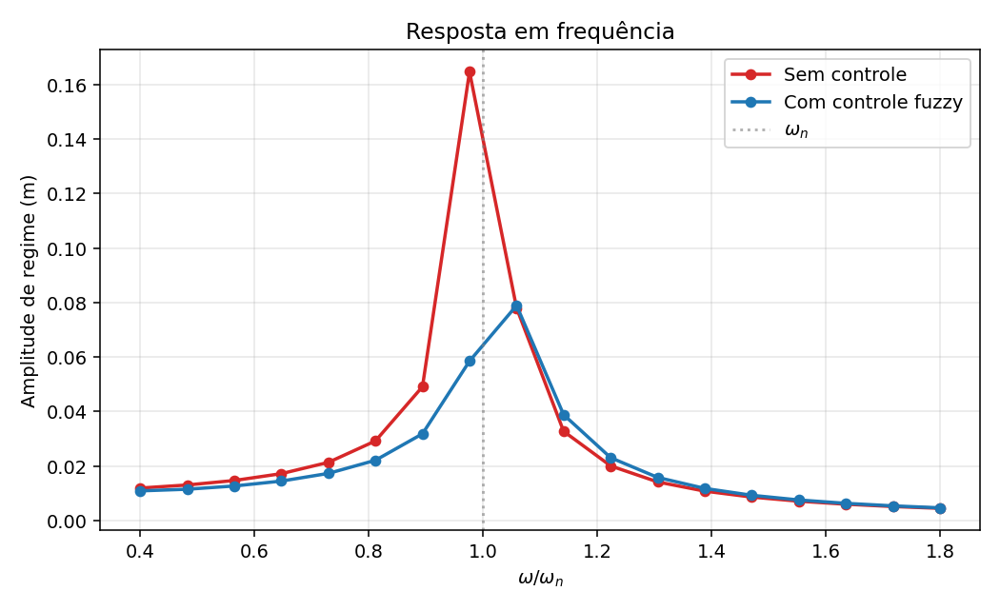

# Report — Active vibration control of a SDOF structure with fuzzy logic

**PCS5708 — Exercise 2 — Mamdani approach**

> Per the assignment, this report presents the four required deliverable views:
>
> 1. **View 1 — Input variables** (§3)
> 2. **View 2 — Output variable** (§4)
> 3. **View 3 — Rule base** (§5)
> 4. **View 4 — Application example of the control system** (§9)
>
> The remaining sections give context and supporting analysis.

---

## 1. Problem specification

Design an active vibration control system for a mechanical structure modeled as a single-degree-of-freedom (SDOF) mass-spring-damper, subject to external harmonic excitation.

The control force is applied by a generic actuator (in a real structure this would be a hydraulic, electromagnetic, or piezoelectric actuator) and is determined by a Mamdani fuzzy controller.

## 2. Variables and dimensioning

### Plant parameters

| Symbol     | Value             | Description                                               |
| ---------- | ----------------- | --------------------------------------------------------- |
| $m$        | $1.0$ kg          | Mass                                                      |
| $k$        | $100$ N/m         | Spring stiffness                                          |
| $\zeta$    | $0.02$            | Damping ratio (lightly damped structure)                  |
| $c$        | $0.4$ N·s/m       | $c = 2\zeta\sqrt{km}$                                     |
| $\omega_n$ | $10$ rad/s        | Undamped natural frequency ($\sqrt{k/m}$)                 |
| $f_n$      | $\approx 1.59$ Hz | Natural frequency in Hz                                   |
| $F_0$      | $1.0$ N           | Amplitude of the harmonic excitation                      |

### Controller variables

| Type   | Variable     | Domain               | Linguistic terms      |
| ------ | ------------ | -------------------- | --------------------- |
| Input  | Deslocamento | $[-0.3; +0.3]$ m     | NG, NP, Z, PP, PG     |
| Input  | Velocidade   | $[-3; +3]$ m/s       | NG, NP, Z, PP, PG     |
| Output | Força        | $[-3; +3]$ N         | NG, NP, Z, PP, PG     |

The universes of discourse were chosen to bracket the open-loop response near resonance: the steady-state amplitude of the uncontrolled response at resonance is $x_\text{ss} = F_0 / (c\,\omega_n) \approx 0.25$ m, with peak velocity $\approx 2.5$ m/s. The force range (3× $F_0$) gives ample control authority.

The linguistic-term abbreviations follow the convention:

- **NG** — Negative Big (Negativo Grande)
- **NP** — Negative Small (Negativo Pequeno)
- **Z** — Zero
- **PP** — Positive Small (Positivo Pequeno)
- **PG** — Positive Big (Positivo Grande)

---

## 3. View 1 — Input variables

### 3.1 Deslocamento

Five membership functions over $[-0.3; +0.3]$ m: two shoulders (NG, PG) and three triangulars (NP, Z, PP), with overlap at $\mu = 0.5$ between neighbors — the standard partition for a Mamdani controller.



### 3.2 Velocidade

Same structure, mapped to $[-3; +3]$ m/s.



---

## 4. View 2 — Output variable

Control force over $[-3; +3]$ N, with the same family of five terms. Nominal centroids at the extremes (NG at $-3$ N, PG at $+3$ N) and at the intermediate terms (NP at $-1.5$ N, PP at $+1.5$ N). The Z term is centered at zero, corresponding to no control action.



---

## 5. View 3 — Rule base

The base contains $5 \times 5 = 25$ rules covering all combinations of the two input terms. The row indicates the velocity term; the column indicates the displacement term; the cell holds the output term.

| Velocidade \ Deslocamento | NG  | NP  | Z   | PP  | PG  |
| ------------------------- | --- | --- | --- | --- | --- |
| **NG**                    | PG  | PG  | PG  | PP  | Z   |
| **NP**                    | PG  | PP  | PP  | Z   | NP  |
| **Z**                     | PG  | PP  | Z   | NP  | NG  |
| **PP**                    | PP  | Z   | NP  | NP  | NG  |
| **PG**                    | Z   | NP  | NG  | NG  | NG  |



### 5.1 Logic of the rule base

The base encodes a *phase-plane* style controller (PD-fuzzy): the applied force opposes the dynamics energetically.

- **Main diagonal (NG, NG) → PG** ... **(PG, PG) → NG**: when displacement and velocity have the same sign (mass moving away from the origin), apply maximum opposing force.
- **Anti-diagonal (NG, PG) → Z** ... **(PG, NG) → Z**: when displacement and velocity have opposite signs (mass returning toward the origin), the controller backs off — natural dynamics are already correcting the state.
- **Center row/column (Z, ·)** and **(·, Z)**: the controller acts proportionally to the magnitude of the non-zero input, going from PG when the other is NG, down to NG when the other is PG.

The symmetry is essential: there is no bias in any direction of the response.

---

## 6. Inference

Classical Mamdani:

- t-norm for AND (between antecedents): `min`.
- Mamdani implication: clip the consequent by the rule strength.
- Inter-rule aggregation: `max`.
- Defuzzification: centroid over a discrete 401-point grid in $[-3; +3]$ N.

For each rule $i$:

$$
w_i \;=\; \min\bigl(\mu_{X_i}(x),\; \mu_{V_i}(\dot x)\bigr),
\qquad
\mu_{U_i'}(u) \;=\; \min\bigl(w_i,\; \mu_{U_i}(u)\bigr)
$$

Aggregated output:

$$
\mu_{U'}(u) \;=\; \max_i \mu_{U_i'}(u)
$$

Crisp output by centroid:

$$
u^* \;=\; \frac{\sum_u u \cdot \mu_{U'}(u)}{\sum_u \mu_{U'}(u)}
$$

---

## 7. Control surface

Evaluating the FIS over the grid $[-0.3; 0.3]\,\mathrm{m} \times [-3; 3]\,\mathrm{m/s}$:



The surface is smooth (thanks to term overlap and centroid defuzzification) and **anti-symmetric about the origin** — a desirable property for a vibration controller: the response has the same magnitude for opposite displacements, only with the sign flipped.

---

## 8. Plant model and simulation

Equation of motion:

$$
m\,\ddot x(t) + c\,\dot x(t) + k\,x(t) \;=\; F_\text{ext}(t) + u(t)
$$

with $F_\text{ext}(t) = F_0\sin(\omega t)$ and $u(t) = \mathrm{FIS}(x(t),\,\dot x(t))$ fed back from the plant state.

The plant, the harmonic excitation, the actuator saturation, and the controller are no longer wired together in a hand-rolled RK4 loop; they are assembled as a block diagram (`fuzzy.sim.Diagram`) and integrated as a single ODE by one fixed-step fourth-order Runge-Kutta integrator, with step $\Delta t = 5$ ms and *zero-order hold* on $u$ — that is, the controller output is held constant over each integration step, modeling the behavior of a real actuator commanded in discrete time. The diagram is saved as `diagram.json` (a spec file) alongside the script.

The metric window itself is now validated automatically: `fuzzy.metrics.steady_state` warns whenever fewer than four time constants of settling precede the averaging window, so an under-settled reference biasing the reported reduction is a class of error that can no longer occur silently.

---

### 8.1 Block diagram

Generated from the executable diagram by `Diagram.to_mermaid()`, so it cannot
drift from the model that produced the numbers in §9. Skewed boxes are sources,
rounded boxes are sampled (zero-order-held at 5 ms) blocks, square boxes are
continuous.


```mermaid
flowchart LR
    force[/"force<br/>Harmonic"\]
    total["total<br/>Sum"]
    plant["plant<br/>StateSpacePlant"]
    pos["pos<br/>Select"]
    vel["vel<br/>Select"]
    controller(["controller<br/>FISBlock"])
    actuator["actuator<br/>Saturation"]
    force -->|y→ext| total
    total --> plant
    plant --> pos
    plant --> vel
    pos -->|y→deslocamento| controller
    vel -->|y→velocidade| controller
    controller --> actuator
    actuator -->|y→ctrl| total
```

## 9. View 4 — Application example of the control system

Harmonic excitation at resonance ($\omega = \omega_n = 10$ rad/s) — the most severe case. The system starts from rest, $x(0) = \dot x(0) = 0$.

The simulation horizon is now $t_\text{max} = 40$ s (previously 12 s), long enough for the plant's transient — with time constant $\tau = 1/(\zeta\omega_n) = 5$ s — to settle well before the 4 s metrics window begins. The figure below spans the full 40 s: the uncontrolled envelope is visibly still growing toward its $\approx 0.25$ m asymptote for much of the run, while the shaded band marks the steady-state window used for the metrics in §9.1.



### 9.1 Steady-state metrics (last 4 s)

| Metric                       | Uncontrolled | Fuzzy-controlled | Reduction |
| ---------------------------- | -----------: | ---------------: | --------: |
| Peak $\lvert x \rvert$ (m)   |       0.2499 |           0.0734 |    70.6 % |
| RMS $x$ (m)                  |       0.1782 |           0.0521 |    70.8 % |
| Peak $\lvert u \rvert$ (N)   |            — |           0.737 |         — |

### 9.2 Interpretation

- The uncontrolled system, lightly damped ($\zeta = 0.02$) and at resonance, reaches large amplitude — nearly 25 cm of oscillation around the equilibrium position. This matches the analytic steady-state value $x_\text{ss} = F_0/(c\,\omega_n) = 0.2500$ m to four decimals, a useful validation of the corrected horizon.
- With the fuzzy controller active, the steady-state amplitude drops to under **one third** of the uncontrolled value.
- The peak control force ($\approx 0.737$ N) is on the same order as the excitation force ($F_0 = 1$ N) and well below the actuator limit ($U_\text{max} = 3$ N) — there is still margin for more aggressive tuning.
- The force $u(t)$ is essentially in phase opposition to $F_\text{ext}(t)$, as expected for active cancellation: detecting the tendency of motion, the controller applies an opposing force at the right time.

---

## 10. Frequency response

Sweep between $0.4\,\omega_n$ and $1.8\,\omega_n$, recording the steady-state amplitude in each case. The sweep now also uses $t_\text{max} = 40$ s per frequency, so the resonance peak is no longer understated by an under-settled window:



- **Resonance peak**: the controller drastically reduces the amplitude near $\omega \approx \omega_n$, flattening the resonant peak.
- **Off resonance**: the controller's contribution is small (the plant is already stable, and the controller — seeing small displacement and velocity — commands a force close to zero).
- **Above $1.3\,\omega_n$**: the two curves nearly coincide — at high frequencies the plant naturally attenuates the excitation, and the fuzzy action is minimal.

This is the typical pattern of an active vibration controller: largest benefit around resonance, no penalty in regions that are already well behaved.

---

## 11. Conclusions

- The Mamdani controller designed **works**: ~71 % reduction in peak and RMS amplitude at resonance, with peak control force well below the actuator limit.
- The *phase-plane* structure of the rule base is equivalent to a non-linear PD controller, but with the advantage of **interpretability**: every cell of the 5 × 5 table is justifiable from expert knowledge.
- The **anti-symmetric control surface** ensures uniform response in both directions; the smoothing introduced by the centroid avoids *bang-bang* behavior.
- Amplitude reduction could be improved by:
  1. **More linguistic terms** (7 or 9 terms per variable) — would refine the controller's resolution.
  2. **Tuning the input/output scaling gains** — possibly via a genetic algorithm, as in the literature.
  3. **A faster actuator** — in this exercise the controller uses *zero-order hold* at 5 ms, close to a real implementation.
  4. **The input scaling gains (equivalently, tighter universes of discourse)** — not a wider force universe: the controller peaks at 0.737 N out of the 3 N available, so it is not authority-limited at all. A companion study in `REPORT_comparison.md` shows that raising the input scaling gain to 10 takes the same 25-rule controller to a peak of 0.0102 m at essentially the same control effort (0.968 N) — i.e. within 10 % of PID. Separately, centroid defuzzification means the reachable output range is only $\pm 2.505$ N of the declared $\pm 3$ N, so the saturation limit never actually binds.
- The choice between Mamdani and Sugeno favored Mamdani here for pedagogical clarity: every rule reads as a sentence, and the physical symmetry of the problem (a vibration controller cannot have directional bias) emerges naturally from the symmetry of the rule map.

---

---

## Errata — corrections after submission

This report was submitted with the numbers in the left-hand column below. Later
verification of the code found two measurement errors and one wrong statement.
The body of the report has been updated; this section records what changed and
why, so the submitted version can be reconciled with this one.

### E.1 The steady-state window was not steady state

Metrics were taken over the final 4 s of a **12 s** run. The plant's transient decays
with $\tau = 1/(\zeta\omega_n) = 5$ s, so 8 s of settling is under two time constants —
the *uncontrolled* reference had not reached its asymptote, while both controlled cases
had. The error was therefore one-sided, and it **understated** the controller's benefit.

The horizon is now 40 s ($\ge 4\tau$ settling plus the window). The corrected open-loop
peak matches the analytic $F_0/(c\,\omega_n) = 0.2500$ m to four decimals, which the
submitted horizon could not.

### E.2 Peak $\lvert u \rvert$ was a whole-run maximum

Every other entry in §9.1 was windowed; peak $\lvert u \rvert$ was computed over the
entire run. It is now windowed like the rest.

### E.3 Corrected values

| Quantity | As submitted | Corrected | Why |
| --- | ---: | ---: | --- |
| Peak $\lvert x \rvert$, uncontrolled (m) | 0.2270 | **0.2499** | E.1 — window was transient |
| RMS $x$, uncontrolled (m) | 0.1532 | **0.1782** | E.1 |
| Peak $\lvert x \rvert$, controlled (m) | 0.0742 | **0.0734** | E.1 |
| RMS $x$, controlled (m) | 0.0526 | **0.0521** | E.1 |
| Peak $\lvert u \rvert$ (N) | 0.7443 | **0.737** | E.2 — was a whole-run max |
| Reduction, peak | 67.3 % | **70.6 %** | follows from E.1 |
| Reduction, RMS | 65.7 % | **70.8 %** | follows from E.1 |

The direction matters: **the submitted figures understated the controller.** The design,
the rule base, the membership functions, and the qualitative conclusions are unaffected.

### E.4 One wrong recommendation in §11

The submitted §11 suggested that *"a wider force universe would give more authority."*
That is wrong twice over. The controller never exceeds 0.737 N of the 3 N available, so it
is not authority-limited; and centroid defuzzification cannot reach the edges of its output
universe in any case, capping the attainable command at $\pm 2.505$ N. The effective lever
is the **input scaling gain** — see `REPORT_comparison.md` §3.4.

### E.5 Method changes with no effect on results

The simulation was rewritten from a hand-rolled RK4 loop to an assembled block diagram
(`fuzzy.sim`). This was verified behaviour-preserving *before* the fixes above were applied:
the rebuilt model reproduced the submitted numbers to $1.8\times10^{-13}$ in displacement.
Membership functions and rules also became declarative data rather than Python closures,
which shifts the control surface by $\sim 10^{-15}$ (one ulp in one breakpoint) and changes
no reported figure.

## 12. How to run

The repository must be installed once with `pip install -e .` from the repository root (the scripts no longer manipulate `sys.path`). Then, from the repository root:

```bash
pip install -e .
python exercises/exercicio2_sdof_vibration_control/sdof_vibration.py
```

The run generates the seven figures in `figures/` and prints the steady-state metrics to the terminal. Because of the longer 40 s horizon, the run now takes ~35 s.
