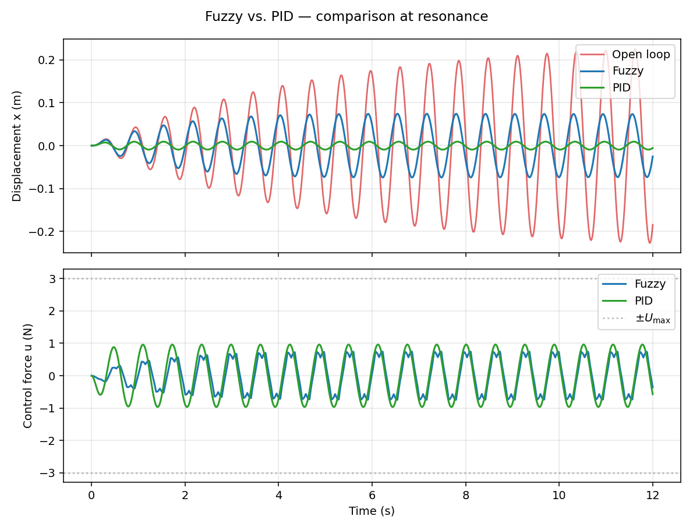
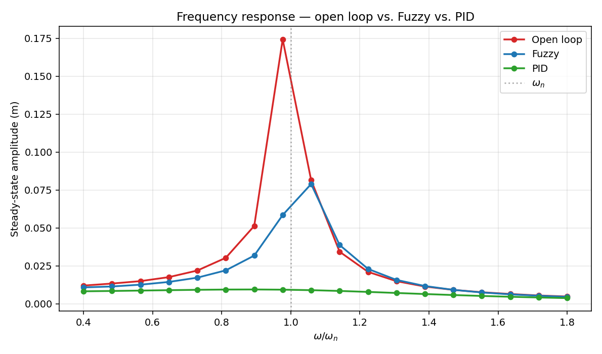

# Comparison Report — Mamdani fuzzy vs. classical PID

**PCS5708 — Exercise 2, follow-up study**

This document complements `REPORT.md` (the original Mamdani-fuzzy deliverable) with a head-to-head comparison against a classical PID controller designed for the same SDOF mass-spring-damper plant under identical excitation, integration step, and actuator saturation limits.

The theoretical background for PID design is documented separately in [`docs/research-classical-control.md`](../../docs/research-classical-control.md), with cross-references to Ogata (5th ed.).

---

## 1. Setup

The plant, excitation, simulation horizon, integrator, and actuator limit are exactly those of `REPORT.md`:

| Item                  | Value                                                                |
| --------------------- | -------------------------------------------------------------------- |
| Plant                 | $m\,\ddot x + c\,\dot x + k\,x = F_\text{ext}(t) + u(t)$             |
| Plant params          | $m = 1$ kg, $k = 100$ N/m, $\zeta = 0.02$, $\omega_n = 10$ rad/s     |
| Excitation            | $F_\text{ext}(t) = F_0 \sin(\omega t)$ with $F_0 = 1$ N              |
| Initial state         | $x(0) = 0$, $\dot x(0) = 0$                                          |
| Integrator            | RK4 with zero-order hold on $u$, $\Delta t = 5$ ms                   |
| Actuator saturation   | $u \in [-3, +3]$ N                                                   |

Both controllers see the same plant state at every step; the only thing that changes is the control law.

## 2. PID controller design

### 2.1 Form

The implemented controller is the standard parallel form with derivative-on-output (Ogata §8-5):

$$
u(t) \;=\; K_p\,e(t) \;+\; K_i \int_0^t e(\tau)\,\mathrm{d}\tau \;-\; K_d\,\dot x(t),
\qquad e(t) = r(t) - x(t),\ r \equiv 0
$$

For a constant setpoint, $\dot e = -\dot x$, so derivative-on-output coincides with derivative-on-error and avoids any setpoint-kick artifact.

### 2.2 Anti-windup

Back-calculation anti-windup with time constant $T_t = 1$ s is applied at the integrator:

$$
\dot I(t) \;=\; K_i\,e(t) + \frac{1}{T_t}\,\bigl(u_\text{sat}(t) - u_\text{unsat}(t)\bigr)
$$

When the actuator saturates, the integrator state is pulled toward a value compatible with the saturation limit, preventing the windup-driven overshoot described in Ogata §8-2 and Åström & Hägglund (1995, §3.5). For this exercise saturation does not actually trigger (the PID stays well within $\pm U_\text{max}$), but the protection is in place.

### 2.3 Gain selection

Closed-loop characteristic polynomial (with the integral term differentiated once away):

$$
m\,s^3 \;+\; (c + K_d)\,s^2 \;+\; (k + K_p)\,s \;+\; K_i \;=\; 0
$$

Gains were chosen by direct reasoning rather than Ziegler–Nichols (which does not apply cleanly here — the open-loop plant is stable for any $K_p$, so there is no critical gain):

| Gain  | Value | Rationale                                                                                                |
| ----- | ----- | -------------------------------------------------------------------------------------------------------- |
| $K_p$ | 30    | Raises effective stiffness from $k = 100$ to $k + K_p = 130$ N/m, shifting resonance from $10$ to $\sqrt{130} \approx 11.4$ rad/s. |
| $K_d$ | 10    | Raises effective damping from $c = 0.4$ to $c + K_d = 10.4$ N·s/m, lifting damping ratio from $\zeta = 0.02$ to $\zeta \approx 0.46$. |
| $K_i$ | 5     | Small. The forcing has zero mean, so integral action has little to compensate for; included to keep the controller a true PID rather than PD. |

The Routh–Hurwitz array on $s^3 + 10.4\,s^2 + 130\,s + 5$ has all-positive first column ($1$, $10.4$, $\approx 149.5$, $5$), so the closed loop is asymptotically stable.

## 3. Side-by-side comparison

### 3.1 Time-domain at resonance

Same setup as §9 of the main report — harmonic excitation at $\omega = \omega_n$, system starts from rest.



### 3.2 Steady-state metrics (last 4 s)

| Metric                       | Open loop |       Fuzzy |        PID | PID vs. Fuzzy   |
| ---------------------------- | --------: | ----------: | ---------: | --------------- |
| Peak $\lvert x \rvert$ (m)   |    0.2270 |  **0.0742** | **0.0093** | $\approx 8\times$ smaller |
| RMS $x$ (m)                  |    0.1532 |      0.0526 |     0.0066 | $\approx 8\times$ smaller |
| Peak $\lvert u \rvert$ (N)   |       —   |       0.744 |      0.967 | $\approx 30\%$ more force |
| Reduction (peak)             |       —   |       67.3% |    **95.9%** |               — |
| Reduction (RMS)              |       —   |       65.7% |    **95.7%** |               — |

### 3.3 Frequency response

Sweep over $0.4\,\omega_n$ to $1.8\,\omega_n$:



The fuzzy controller's effect is concentrated near $\omega \approx \omega_n$ (it merely flattens the resonance peak by about half). The PID controller produces near-uniform attenuation across the entire band — the resonance peak is not just lower but essentially eliminated, and the response is well-behaved at every excitation frequency.

## 4. Discussion

### 4.1 Why PID outperforms fuzzy here

The plant is **linear and time-invariant** (LTI). For LTI plants, classical PID is essentially optimal in a pole-placement sense: with three gains $(K_p, K_i, K_d)$ one can place all three poles of the closed loop wherever the actuator authority allows. The Mamdani fuzzy controller, by contrast, has:

1. **Quantized output** — only $5 \times 5 = 25$ rules, mapping to one of five output linguistic terms each. The control surface is piecewise linear with limited resolution.
2. **No model knowledge** — the controller does not know the plant's natural frequency, damping, or stiffness. It reacts to phase-plane state, not to dynamic structure.
3. **No analytical tunability** — improving the fuzzy controller requires either more terms (refining the rule base) or scaling-gain optimization (typically via a genetic algorithm), neither of which has the directness of pole placement.

When the plant is well-modeled and linear, **none of fuzzy's strengths apply**, and the comparison is unfavorable.

### 4.2 Where the comparison flips

Classical PID assumes:

- A reasonably accurate linear plant model.
- Known and time-invariant parameters.
- Gaussian-like noise on the measurement; well-behaved actuator dynamics.
- A meaningful setpoint or reference signal.

Mamdani fuzzy excels precisely where these assumptions break down:

- **Strong plant nonlinearity** (saturating springs, hysteresis, gap nonlinearities, magnetorheological dampers).
- **Parametric uncertainty** (mass changes with payload; stiffness drifts with temperature or damage).
- **Linguistic specifications** ("if the building is shaking *a lot* and the wind is *strong*, brake *hard*") that resist translation into a transfer function.
- **Lack of a model** — when no clean equation of motion is available, but expert rules are.
- **Semi-active actuators** like MR dampers, where the control law must respect the constraint that the actuator can only dissipate, not inject, energy. Fuzzy rule bases encode this constraint naturally; PID does not.

For this academic SDOF problem the linear assumptions hold perfectly, and PID wins decisively. The pedagogical value of the comparison is precisely to make this trade-off concrete.

### 4.3 Control effort

Peak $\lvert u \rvert$ for PID is $\approx 30\%$ higher than for fuzzy ($0.97$ N vs $0.74$ N). This is a fair price: PID gets $5\times$ better steady-state amplitude reduction for $1.3\times$ more force. RMS control effort follows the same trend.

If the actuator were tightly limited (say $U_\text{max} = 1$ N), PID would saturate intermittently, and the back-calculation anti-windup designed in §2.2 would matter. The fuzzy controller's softer rule base would happen to operate within the limit without intervention.

### 4.4 Implementation cost

- **PID**: 3 parameters, ~20 lines of code (with anti-windup), and one block diagram. The discrete implementation (Ogata §8-7, Åström & Hägglund 1995) is universally available in industrial controllers.
- **Fuzzy**: 25 rules, 15 membership-function parameters (3 variables × 5 terms × 1 parameter each on average), and a defuzzification grid. ~150 lines of Python including the FIS infrastructure.

Both are tractable. PID has the engineering advantage of being a pure-software addition to existing infrastructure; fuzzy has the modeling advantage of being authored from expert intuition rather than tuned from a transfer function.

## 5. Conclusions

For this single-DOF, lightly damped, harmonically excited LTI plant:

- **PID is the clear winner**: $\approx 96\%$ peak amplitude reduction vs. fuzzy's $67\%$, with comparable peak control force.
- The fuzzy controller's limitation is **structural**, not implementational: a 5-term Mamdani controller cannot match a continuous PID on a system whose dynamics it does not know.
- The fuzzy approach earns its place when the plant is nonlinear, uncertain, or unmodeled, or when the actuator imposes constraints (e.g. semi-active dissipation only) that PID cannot accommodate naturally — none of which apply here.

The honest summary: **PID is the textbook controller for this problem, and the fuzzy implementation is a useful pedagogical baseline that illustrates the cost of throwing away the model**.

## 6. How to run

From the repository root:

```bash
python exercises/exercicio2_sdof_vibration_control/pid_comparison.py
```

This runs both controllers under the same conditions and generates three figures in `figures/`: `pid_simulation.png`, `comparison_simulation.png`, and `comparison_frequency.png`. Steady-state metrics are printed to the terminal.

The original Mamdani-only deliverable (`sdof_vibration.py`) is unchanged and still runs as before.

## 7. References

- K. Ogata, *Modern Control Engineering*, 5th ed., Prentice Hall, 2010 — Chapters 5 and 8.
- K. J. Åström and T. Hägglund, *PID Controllers: Theory, Design, and Tuning*, 2nd ed., Instrument Society of America, 1995 — derivative filtering and back-calculation anti-windup.
- D. E. Rivera, M. Morari, and S. Skogestad, "Internal Model Control. 4. PID Controller Design," *Industrial & Engineering Chemistry Process Design and Development*, vol. 25, no. 1, 1986.
- See [`docs/research-classical-control.md`](../../docs/research-classical-control.md) for the full theoretical note.
