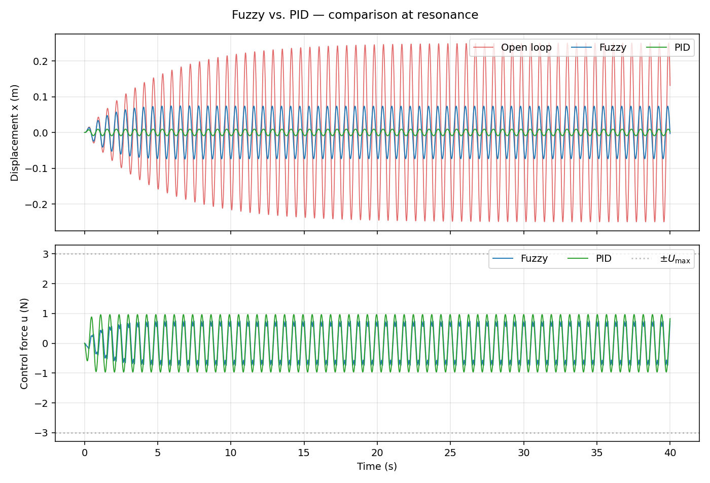
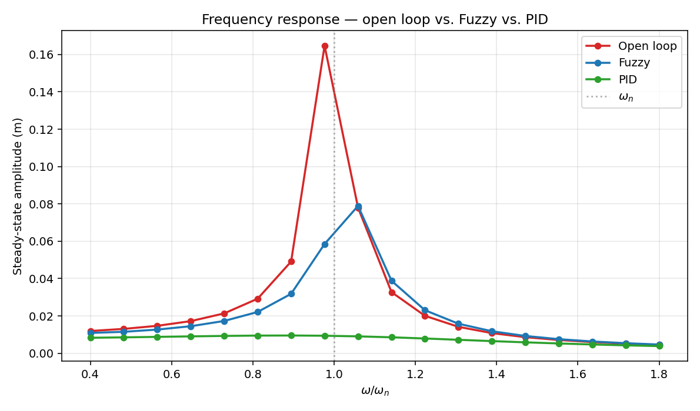
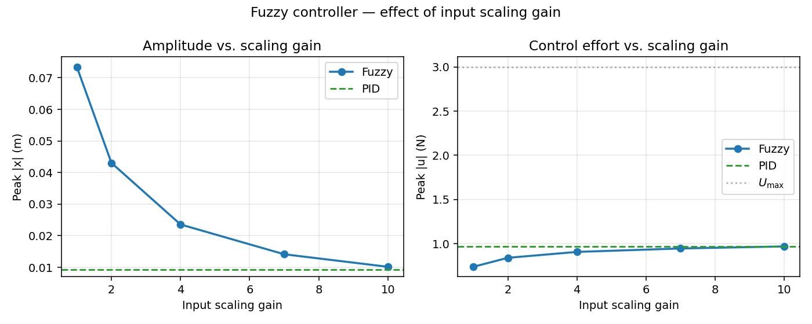

# Comparison Report — Mamdani fuzzy vs. classical PID

**PCS5708 — Exercise 2, follow-up study**

This document complements `REPORT.md` (the original Mamdani-fuzzy deliverable) with a head-to-head comparison against a classical PID controller designed for the same SDOF mass-spring-damper plant under identical excitation, integration step, and actuator saturation limits.

The theoretical background for PID design is documented separately in [`docs/research-classical-control.md`](../../docs/research-classical-control.md), with cross-references to Ogata (5th ed.).

> **Revision note.** An earlier version of this report concluded that the fuzzy controller's shortfall against PID was *structural* — that a 5-term Mamdani controller simply cannot match a continuous PID. §3.4 shows that conclusion was wrong. The gap was a **scaling-gain tuning gap**, and closing it takes the same 25 rules to within 10 % of PID at equal control effort. §4.1 has been rewritten accordingly. The measurement horizon was also corrected (see §1).

---

## 1. Setup

The plant, excitation, integrator, and actuator limit are exactly those of `REPORT.md`:

| Item                  | Value                                                                |
| --------------------- | -------------------------------------------------------------------- |
| Plant                 | $m\,\ddot x + c\,\dot x + k\,x = F_\text{ext}(t) + u(t)$             |
| Plant params          | $m = 1$ kg, $k = 100$ N/m, $\zeta = 0.02$, $\omega_n = 10$ rad/s     |
| Excitation            | $F_\text{ext}(t) = F_0 \sin(\omega t)$ with $F_0 = 1$ N              |
| Initial state         | $x(0) = 0$, $\dot x(0) = 0$                                          |
| Integrator            | RK4 on the assembled block diagram, zero-order hold on $u$, $\Delta t = 5$ ms |
| Simulation horizon    | $t_\text{max} = 40$ s                                                |
| Metric window         | final $4$ s                                                          |
| Actuator saturation   | $u \in [-3, +3]$ N, shared by both controllers                       |

Both controllers see the same plant state at every step; the only thing that changes is the control law. Plant, excitation, actuator, and controller are assembled as a block diagram (`fuzzy.sim`), so "same plant, different controller" is a substitution of one block rather than a second copy of the simulation loop.

**Corrected horizon.** The earlier version of this study used $t_\text{max} = 12$ s. The plant's transient decays with $\tau = 1/(\zeta\omega_n) = 5$ s, so a 4 s window at 12 s was not steady state: the *open-loop* reference was still 9 % below its asymptote while both controlled cases had already settled, biasing every reduction figure downward. At $t_\text{max} = 40$ s the open-loop peak is $0.2499$ m against the analytic $F_0/(c\,\omega_n) = 0.2500$ m — a useful check that the integrator and the metric window are both right. `fuzzy.metrics.steady_state` now warns whenever fewer than $4\tau$ of settling precede the window, so this cannot recur silently.

Peak $\lvert u \rvert$ is also now measured over the same window as every other metric; previously it was a whole-run maximum reported inside a steady-state table.

## 2. PID controller design

### 2.1 Form

The implemented controller is the standard parallel form with derivative-on-output (Ogata §8-5):

$$
u(t) \;=\; K_p\,e(t) \;+\; K_i \int_0^t e(\tau)\,\mathrm{d}\tau \;-\; K_d\,\dot x(t),
\qquad e(t) = r(t) - x(t),\ r \equiv 0
$$

For a constant setpoint, $\dot e = -\dot x$, so derivative-on-output coincides with derivative-on-error and avoids any setpoint-kick artifact.

### 2.2 Anti-windup

Back-calculation anti-windup with time constant $T_t = 1$ s is applied at the integrator:

$$
\dot I(t) \;=\; K_i\,e(t) + \frac{1}{T_t}\,\bigl(u_\text{sat}(t) - u_\text{unsat}(t)\bigr)
$$

When the actuator saturates, the integrator state is pulled toward a value compatible with the saturation limit, preventing the windup-driven overshoot described in Ogata §8-2 and Åström & Hägglund (1995, §3.5). For this exercise saturation does not actually trigger (the PID stays well within $\pm U_\text{max}$), but the protection is in place.

### 2.3 Gain selection

Closed-loop characteristic polynomial (with the integral term differentiated once away):

$$
m\,s^3 \;+\; (c + K_d)\,s^2 \;+\; (k + K_p)\,s \;+\; K_i \;=\; 0
$$

Gains were chosen by direct reasoning rather than Ziegler–Nichols (which does not apply cleanly here — the open-loop plant is stable for any $K_p$, so there is no critical gain):

| Gain  | Value | Rationale                                                                                                |
| ----- | ----- | -------------------------------------------------------------------------------------------------------- |
| $K_p$ | 30    | Raises effective stiffness from $k = 100$ to $k + K_p = 130$ N/m, shifting resonance from $10$ to $\sqrt{130} \approx 11.4$ rad/s. |
| $K_d$ | 10    | Raises effective damping from $c = 0.4$ to $c + K_d = 10.4$ N·s/m, lifting damping ratio from $\zeta = 0.02$ to $\zeta \approx 0.46$. |
| $K_i$ | 5     | Small. The forcing has zero mean, so integral action has little to compensate for; included to keep the controller a true PID rather than PD. |

The Routh–Hurwitz array on $s^3 + 10.4\,s^2 + 130\,s + 5$ has all-positive first column ($1$, $10.4$, $\approx 149.5$, $5$), so the closed loop is asymptotically stable.

## 3. Side-by-side comparison

### 3.1 Time-domain at resonance

Same setup as §9 of the main report — harmonic excitation at $\omega = \omega_n$, system starts from rest.



### 3.2 Steady-state metrics (final 4 s of a 40 s run)

| Metric                       | Open loop |       Fuzzy |        PID | PID vs. Fuzzy   |
| ---------------------------- | --------: | ----------: | ---------: | --------------- |
| Peak $\lvert x \rvert$ (m)   |    0.2499 |  **0.0734** | **0.0093** | $\approx 8\times$ smaller |
| RMS $x$ (m)                  |    0.1782 |      0.0521 |     0.0066 | $\approx 8\times$ smaller |
| Peak $\lvert u \rvert$ (N)   |       —   |       0.737 |      0.965 | $\approx 31\%$ more force |
| Reduction (peak)             |       —   |       70.6% |    **96.3%** |               — |
| Reduction (RMS)              |       —   |       70.8% |    **96.3%** |               — |

### 3.3 Frequency response

Sweep over $0.4\,\omega_n$ to $1.8\,\omega_n$, each point run for the full $40$ s:



The fuzzy controller's effect is concentrated near $\omega \approx \omega_n$ (it flattens the resonance peak by roughly two thirds). The PID controller produces near-uniform attenuation across the entire band — the resonance peak is not just lower but essentially eliminated, and the response is well-behaved at every excitation frequency.

### 3.4 The decisive experiment — fuzzy input scaling gain

The comparison above gives the PID an advantage that has nothing to do with either method: its three gains were placed analytically from the plant's exact $m, c, k$, while the fuzzy controller's universes of discourse were picked by hand to "bracket the uncontrolled response" and never tuned at all.

The fuzzy analogue of a feedback gain is the **input scaling gain**: the factor applied to $x$ and $\dot x$ before they reach the FIS. A gain of $g$ is equivalent to a $g$-times tighter universe of discourse. Sweeping it — with the rule base, the term count, the output universe, and the actuator limit all untouched:



| Input scaling gain | Peak $\lvert x \rvert$ (m) | RMS $x$ (m) | Peak $\lvert u \rvert$ (N) |
| -----------------: | -------------------------: | ----------: | -------------------------: |
| 1 (as published)   |                     0.0734 |      0.0521 |                      0.737 |
| 2                  |                     0.0430 |      0.0305 |                      0.839 |
| 4                  |                     0.0236 |      0.0166 |                      0.906 |
| 7                  |                     0.0141 |      0.0099 |                      0.945 |
| **10**             |                 **0.0102** |  **0.0071** |                  **0.968** |
| *PID (reference)*  |                    *0.0093* |    *0.0066* |                    *0.965* |

At a scaling gain of 10 the **same 25-rule, 5-term Mamdani controller** reaches a peak of $0.0102$ m against the PID's $0.0093$ m — within $10\%$ — at essentially identical control effort ($0.968$ N vs $0.965$ N). Nothing about the rule base changed.

This is exactly what the state-space reading predicts. Least-squares fitting $u = -(k_1 x + k_2 \dot x)$ to the control surface near the origin gives $k_1 \approx 8.5$, $k_2 \approx 0.85$, i.e. an effective damping ratio of $\zeta \approx 0.06$ — three times the plant's $0.02$, which accounts for the $\approx 70\%$ reduction at gain 1. Multiplying the scaling gain by 10 multiplies those effective gains by 10, giving $\zeta \approx 0.33$, close to the PID's $0.46$. **The two controllers converge because they are placing the closed-loop poles in nearly the same place.** "Scaling gains" in the fuzzy literature and "feedback gains" in state space are the same numbers.

## 4. Discussion

### 4.1 What the comparison actually shows

The naive reading of §3.2 — that fuzzy loses because it is a coarse, quantised approximation of a controller PID expresses exactly — is **not supported** by §3.4. Both controllers reach the same performance at the same control effort on this plant. The 5×5 rule base is not the bottleneck, and neither is the discretised output universe.

What genuinely differs is **how the two designs get there**:

1. **Model knowledge.** The PID gains were computed from $m$, $c$, and $k$ in closed form, and $K_p = 30$ was chosen specifically to move the closed-loop resonance off the $10$ rad/s test frequency. The fuzzy controller knows none of this; it reacts to phase-plane state. On a plant this well characterised, that knowledge is free performance.
2. **Directness of tuning.** Pole placement is a calculation. The fuzzy equivalent was a swept scalar — one parameter, so hardly onerous, but found empirically rather than derived. With more terms or asymmetric universes the search space grows quickly, which is why the literature reaches for genetic algorithms.
3. **Interpretability, in the other direction.** Every cell of the 5×5 table reads as a sentence a domain expert can audit; $K_p = 30$ does not. That is the fuzzy controller's compensating advantage and the reason the exercise is posed this way.

So the honest statement is about **design effort and model dependence, not achievable performance**. The earlier claim that the limitation was "structural, not implementational" had it backwards: it was implementational, and one parameter fixed it.

### 4.2 Where the trade-off flips

Classical PID assumes:

- A reasonably accurate linear plant model.
- Known and time-invariant parameters.
- Gaussian-like noise on the measurement; well-behaved actuator dynamics.
- A meaningful setpoint or reference signal.

Mamdani fuzzy excels precisely where these assumptions break down:

- **Strong plant nonlinearity** (saturating springs, hysteresis, gap nonlinearities, magnetorheological dampers).
- **Parametric uncertainty** (mass changes with payload; stiffness drifts with temperature or damage).
- **Linguistic specifications** ("if the building is shaking *a lot* and the wind is *strong*, brake *hard*") that resist translation into a transfer function.
- **Lack of a model** — when no clean equation of motion is available, but expert rules are.
- **Semi-active actuators** like MR dampers, where the control law must respect the constraint that the actuator can only dissipate, not inject, energy. Fuzzy rule bases encode this constraint naturally; PID does not.

For this academic SDOF problem the linear assumptions hold perfectly, so the *model-based* method wins on effort — but, per §3.4, not on attainable performance.

### 4.3 Control effort

At gain 1, peak $\lvert u \rvert$ for PID is $\approx 31\%$ higher than for fuzzy ($0.965$ N vs $0.737$ N) — the fuzzy controller is simply working less hard, which is the same thing as being detuned. At gain 10 the two are indistinguishable ($0.968$ N vs $0.965$ N) while their amplitudes also converge, confirming that the gain-1 comparison was measuring tuning rather than capability.

Neither controller comes near the $\pm 3$ N actuator limit. Two things follow. First, the anti-windup of §2.2 is never exercised here — it matters only if $U_\text{max}$ were tightened to $\approx 1$ N. Second, the declared $\pm 3$ N is unreachable by the fuzzy controller in any case: centroid defuzzification cannot reach the edges of its output universe, capping the attainable command at $\pm 2.505$ N ($83.5\%$ of the nominal range). Any future study that needs the full range must widen the output universe beyond the intended actuator limit, or defuzzify differently.

### 4.4 Implementation cost

- **PID**: 3 parameters, ~20 lines of code (with anti-windup), and one block diagram. The discrete implementation (Ogata §8-7, Åström & Hägglund 1995) is universally available in industrial controllers.
- **Fuzzy**: 25 rules, 15 membership-function parameters, a defuzzification grid, and — as §3.4 shows — one scaling gain that matters more than any of them.

Both are tractable. PID has the engineering advantage of being a pure-software addition to existing infrastructure; fuzzy has the modeling advantage of being authored from expert intuition rather than tuned from a transfer function.

## 5. Conclusions

For this single-DOF, lightly damped, harmonically excited LTI plant:

- **As published, PID wins decisively**: $96.3\%$ peak amplitude reduction against fuzzy's $70.6\%$, at $31\%$ more peak control force.
- **That gap is a tuning artefact, not a limit of the method.** Raising the fuzzy controller's input scaling gain to 10 — changing no rule, no term, and no universe of the output — brings it to $0.0102$ m against PID's $0.0093$ m at equal control effort. The two controllers end up placing nearly the same closed-loop poles.
- **PID's real advantage is that it got there by calculation.** Its gains follow in closed form from a known $m$, $c$, $k$; the fuzzy controller's equivalent had to be found by sweeping. On a well-characterised linear plant, that is a decisive practical edge — and it is an edge in *design effort*, which is the honest way to state it.
- The fuzzy approach earns its place when the plant is nonlinear, uncertain, or unmodelled, or when the actuator imposes constraints (e.g. semi-active dissipation only) that PID cannot accommodate naturally — none of which apply here.

The honest summary: **PID is the textbook controller for this problem and reaches its result analytically, but the Mamdani controller is not outclassed on performance — only on the directness with which it can be tuned.**

---

## Errata — corrections after submission

Submitted with the numbers below. The measurement corrections are shared with `REPORT.md`
(§E.1–E.2 there); this section records them and the one conclusion that reversed.

### E.1 Corrected values

| Quantity | As submitted | Corrected |
| --- | ---: | ---: |
| Peak $\lvert x \rvert$, open loop (m) | 0.2270 | **0.2499** |
| RMS $x$, open loop (m) | 0.1532 | **0.1782** |
| Peak $\lvert u \rvert$, fuzzy (N) | 0.744 | **0.737** |
| Peak $\lvert u \rvert$, PID (N) | 0.967 | **0.965** |
| Reduction, fuzzy | 67.3 % | **70.6 %** |
| Reduction, PID | 95.9 % | **96.3 %** |

Same cause as `REPORT.md` §E.1: the 4 s metric window sat inside a 12 s run on a plant with
$\tau = 5$ s, so the open-loop reference was measured before it had settled. Both
controllers gain slightly; the ranking is unchanged.

### E.2 The central conclusion was wrong

The submitted §4.1 and §5 concluded that the fuzzy controller's shortfall was
**"structural, not implementational"** — that a 5-term Mamdani controller *cannot* match a
continuous PID on this plant.

That is not supported. Raising the fuzzy controller's **input scaling gain** to 10 — changing
no rule, no linguistic term, and nothing about the output universe — takes the same 25-rule
controller to a peak of 0.0102 m against the PID's 0.0093 m, at essentially identical control
effort (0.968 N vs 0.965 N). The new §3.4 documents the sweep.

The mechanism is visible in state-space terms: least-squares fitting $u = -(k_1 x + k_2\dot x)$
to the control surface gives an effective $\zeta \approx 0.06$ at gain 1 and $\zeta \approx 0.33$
at gain 10, against the PID's $\zeta \approx 0.46$. The two controllers converge because they
end up placing nearly the same closed-loop poles.

What survives is a claim about **design effort and model dependence**, not attainable
performance: the PID's gains follow in closed form from a known $m$, $c$, $k$, while the
fuzzy equivalent had to be found by sweeping. §4.1 and §5 have been rewritten accordingly.

The submitted conclusion was therefore too generous to PID *and* too harsh on the fuzzy
controller — it attributed a tuning gap to the method itself.

## 6. How to run

Install the package once from the repository root, then run the comparison:

```bash
pip install -e .
python exercises/exercicio2_sdof_vibration_control/pid_comparison.py
```

This runs both controllers under the same conditions and generates four figures in `figures/`: `pid_simulation.png`, `comparison_simulation.png`, `comparison_frequency.png`, and `gain_sweep.png`. Steady-state metrics and the scaling-gain sweep are printed to the terminal. The run takes about a minute, most of it in the 18-point frequency sweep at the corrected 40 s horizon.

The Mamdani-only deliverable (`sdof_vibration.py`) shares the same plant, diagram builder, and metric definitions, and still runs standalone.

## 7. References

- K. Ogata, *Modern Control Engineering*, 5th ed., Prentice Hall, 2010 — Chapters 5 and 8.
- K. J. Åström and T. Hägglund, *PID Controllers: Theory, Design, and Tuning*, 2nd ed., Instrument Society of America, 1995 — derivative filtering and back-calculation anti-windup.
- D. E. Rivera, M. Morari, and S. Skogestad, "Internal Model Control. 4. PID Controller Design," *Industrial & Engineering Chemistry Process Design and Development*, vol. 25, no. 1, 1986.
- See [`docs/research-classical-control.md`](../../docs/research-classical-control.md) for the full theoretical note.
